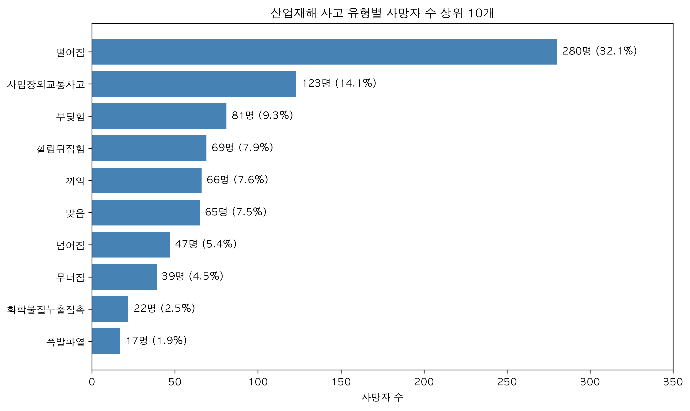
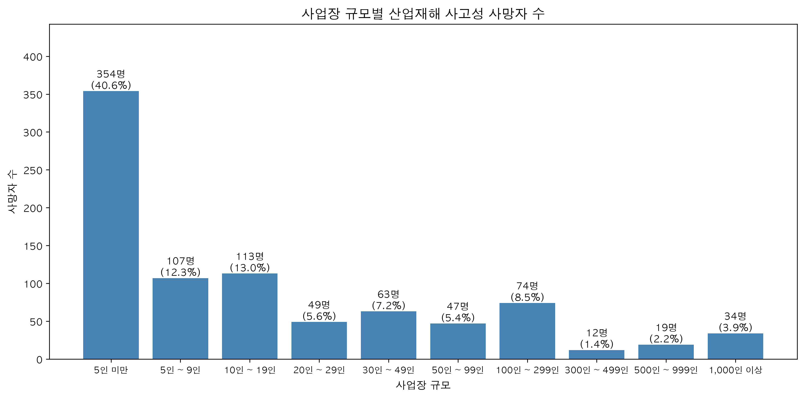
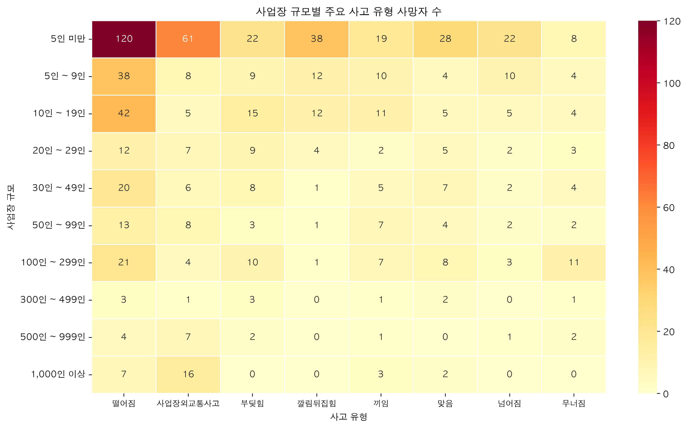
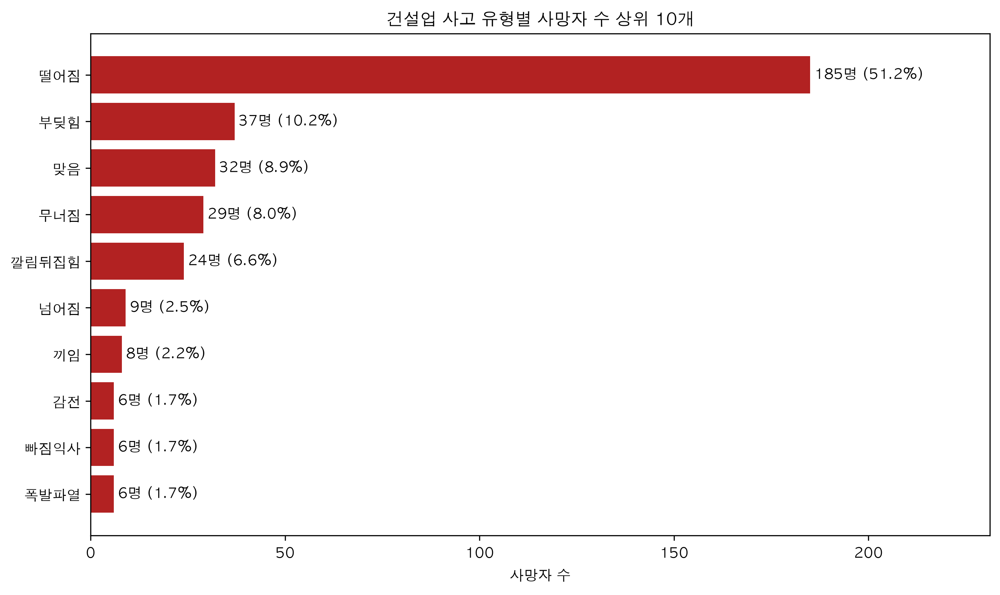

# 산업재해 사망사고 데이터 분석

> 산업재해 사망자 공공데이터를 활용해 사고 유형, 업종, 사업장 규모별 사망사고를 분석하고 안전관리 우선 대상을 도출한 데이터 분석 프로젝트입니다.

**Tech Stack**  
`Python` · `Pandas` · `Matplotlib` · `Seaborn` · `Jupyter Notebook`



## 프로젝트 목적

- 산업재해 사망자의 전체 분포 파악
- 주요 사고성 사망 원인 확인
- 대업종·중업종별 사망자 수 비교
- 사업장 규모별 사망사고 집중도 분석
- 분석 결과를 기반으로 안전관리 우선 대상 도출

## 데이터 개요

- 데이터 출처: 산업안전보건 관련 공공데이터
- 데이터 크기: **300행, 28열**
- 분류 기준: 대업종, 중업종, 사업장 규모
- 주요 수치: 총계 및 사고 유형별 사망자 수
- 결측치: **0개**
- 중복 행: **0개**

사고 유형에는 떨어짐, 넘어짐, 부딪힘, 맞음, 무너짐, 끼임, 감전, 폭발·파열, 화재, 업무상질병 등이 포함되어 있습니다.

## 분석 과정

1. CP949 형식의 원본 CSV 파일 불러오기
2. 데이터 구조와 자료형 확인
3. 결측치와 중복 행 검사
4. 총계와 사고 유형별 합계 일치 여부 검증
5. 분석용 데이터를 UTF-8 형식으로 변환
6. 업무상질병을 제외한 사고성 사망자 분리
7. 사고 유형·업종·사업장 규모별 사망자 수 분석
8. 주요 결과 시각화 및 CSV 결과표 저장

## 주요 분석 결과

- 전체 사망자 **2,248명** 중 사고성 사망자는 **872명**입니다.
- **떨어짐 사고 280명(32.1%)**으로 사고성 사망 원인 중 가장 높은 비중을 차지했습니다.
- 상위 3개 사고 유형이 전체 사고성 사망자의 **55.5%**를 차지했습니다.
- **50인 미만 사업장 686명(78.7%)**으로 소규모 사업장에 사고성 사망자가 집중되었습니다.
- 대업종 중 **건설업 361명**으로 사고성 사망자가 가장 많았습니다.
- 건설업에서는 **떨어짐 사고**가 주요 사망 원인으로 나타났습니다.

## 주요 시각화

### 사업장 규모별 사고성 사망자 수



### 사업장 규모별 주요 사고 유형



### 건설업 사고 유형별 사망자 수



## 분석 결론

분석 결과 산업재해 사고성 사망자는 **50인 미만 사업장과 건설업에 집중**되어 있었습니다.

특히 **떨어짐 사고가 사고성 사망 원인 중 가장 높은 비중**을 차지했으며, 건설업에서도 주요 사망 원인으로 확인되었습니다.

따라서 소규모 사업장을 우선적인 안전관리 대상으로 설정하고, 건설 현장의 추락 방지시설 점검과 보호구 착용 관리 등을 강화할 필요가 있습니다.

## 실행 방법

필요한 라이브러리를 설치합니다.

```bash
pip install -r requirements.txt
```

## 프로젝트 구조

```text
industrial-safety-analysis/
├── data/
│   ├── raw/
│   │   └── industrial_accident_deaths.csv
│   └── processed/
│       └── industrial_accident_deaths_clean.csv
│
├── notebooks/
│   ├── 01_data_check.ipynb
│   └── 02_accident_analysis.ipynb
│
├── outputs/
│   ├── images/
│   │   ├── accident_type_top10.png
│   │   ├── deaths_by_industry.png
│   │   ├── deaths_by_subindustry_top10.png
│   │   ├── deaths_by_company_size.png
│   │   ├── accident_heatmap_by_size.png
│   │   └── top_industry_accident_types.png
│   │
│   └── tables/
│       ├── accident_type_summary.csv
│       ├── industry_summary.csv
│       ├── subindustry_summary.csv
│       ├── company_size_summary.csv
│       └── top_industry_accident_summary.csv
│
├── requirements.txt
├── .gitignore
└── README.md
```